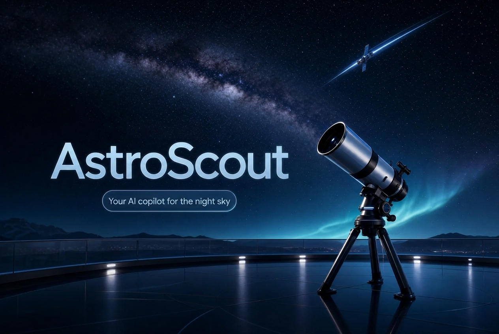

# AstroScout - live sky tools

AstroScout is a public, browser-based night-sky tool. It keeps the scroll-driven glass design, but the core panels now fetch live public data for ISS position, upcoming launches, local cloud cover, moon phase, and near-Earth asteroid close approaches.

**Live site:** https://deekshitvegi.github.io/astroscout-landing/



## What Works

- **Interactive planetarium** - drag-to-pan canvas sky with stars, constellation lines, planets, and a time slider
- **Live ISS tracker** - current station latitude, longitude, altitude, speed, visibility, and map position
- **Live launch tracker** - upcoming launches and countdowns from Launch Library
- **Tonight report** - Open-Meteo cloud cover, visibility, rain chance, temperature, and a city/location control
- **Asteroid watch** - today's nearest known approaches from NASA NeoWs
- **Ask live data** - browser-side assistant for ISS, launches, weather, asteroids, and moon phase with visible sources
- **Scroll experience** - retained hero scrub, sticky guide, parallax starfield, aurora orbs, glass panels, and reduced-motion support

## Stack

React 19, Vite, Tailwind CSS v4, GSAP + ScrollTrigger, Lenis, GitHub Pages.

## Getting Started

```bash
cd app
npm install
npm run dev
npm run build
```

The generated media assets are committed under `app/public` so GitHub Pages can build the site without depending on the original Higgsfield deployment.

## Deployment

Pushing to `main` runs `.github/workflows/deploy.yml`, builds the app from `app/`, and publishes `app/dist` to GitHub Pages.

## Project Structure

```text
app/
  src/
    components/astro/   # all site sections + scroll runtime
      live-data.ts      # browser API clients and data formatting
      hero.tsx          # scroll-scrubbed film hero
      how-it-works.tsx  # sticky guide to the on-page tools
      planetarium.tsx   # drag-to-pan canvas sky
      star-catalog.ts   # J2000 star, constellation, and planet data
      iss-tracker.tsx   # live ISS map and telemetry
      launches.tsx      # live launch board
      tonight.tsx       # sky report + NASA asteroid bento
      ask-anything.tsx  # live data assistant
      free-band.tsx     # source credits + GitHub link
      starfield.tsx     # parallax starfield + aurora orbs
      scroll-runtime.ts # Lenis + GSAP bridge
    styles.css          # design tokens + glass system
  public/assets/        # generated media assets
  public/frames/hero/   # 61 scrub film frames
```

## Data Sources

[NASA NeoWs](https://api.nasa.gov), [Where the ISS at](https://wheretheiss.at), [Open-Meteo](https://open-meteo.com), and [Launch Library](https://thespacedevs.com).

All visual assets were AI-generated for this project.
